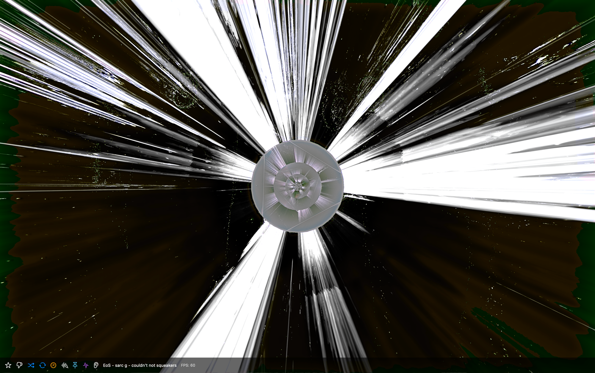

# Kaleido Pro

**Real-time music visualizer for macOS**

Turn any audio into stunning visuals. Powered by the legendary Milkdrop engine (via projectM).

## Download

**[Download Kaleido Pro v1.1](https://github.com/kaleido-app-macos/kaleido-app-macos.github.io/releases/latest/download/KaleidoPro-v1.1.dmg)** (158 MB)

24-hour free trial. No account needed.

**[Buy License](https://kaleidopro.lemonsqueezy.com/checkout/buy/9a18a572-7e00-4038-9b99-46994d0fe7b8)** — One-time purchase. No subscription. Works on up to 5 Macs.

## Installation

1. Download the DMG file
2. Open it and drag **Kaleido Pro.app** to your Applications folder
3. **First launch** — macOS blocks all downloaded apps on first launch. When you see the warning:
   - Click **Done** on the warning dialog
   - Open **System Settings > Privacy & Security**
   - Scroll down to the **Security** section
   - Find *"Kaleido Pro.app was blocked"* and click **Open Anyway**
   - Enter your password when prompted
   - This is a one-time step. After this, the app opens normally.
4. Launch and enjoy — 24-hour free trial, no account needed

## Features

- **9,000+ visual presets** — Milkdrop-compatible presets created by a worldwide community of visual artists
- **System audio capture** — Reacts to audio from any app (Spotify, Apple Music, YouTube, SoundCloud) with no virtual audio drivers needed
- **Microphone & audio input** — Connect a microphone or audio interface for live performances and DJ setups
- **Smart auto-cycling** — Shuffle mode, timed transitions, and audio-reactive switching that changes presets when the music changes
- **Curate your collection** — Star favorites, blocklist presets you don't like, filter to audio-reactive only
- **Adaptive performance** — Automatic quality adjustment keeps visuals smooth; low-FPS presets are skipped automatically
- **Spectrum analyzer** — Real-time frequency spectrum overlay
- **Full-screen & projector ready** — Immersive full-screen mode for parties, bars, and live events

## System Requirements

- macOS 14.2 (Sonoma) or later
- Apple Silicon or Intel Mac with OpenGL support

## Licensing

Kaleido Pro is commercial software with a 24-hour free trial.

### Third-Party Libraries

**projectM 4.1.0**
Copyright (c) 2003-2025 projectM Team
Licensed under the [GNU Lesser General Public License v2.1 (LGPL-2.1)](https://www.gnu.org/licenses/old-licenses/lgpl-2.1.html).

Kaleido Pro links dynamically against projectM. The projectM source code is available at [github.com/projectM-visualizer/projectm](https://github.com/projectM-visualizer/projectm).

**Milkdrop Presets**
The bundled presets are community-created Milkdrop presets distributed with projectM under their original licensing terms.

## Contact

- Email: kaleidopro.app@gmail.com
- Website: [kaleido-app-macos.github.io](https://kaleido-app-macos.github.io)

---

*Signed and notarized by Apple. Runs on any Mac without security warnings.*
